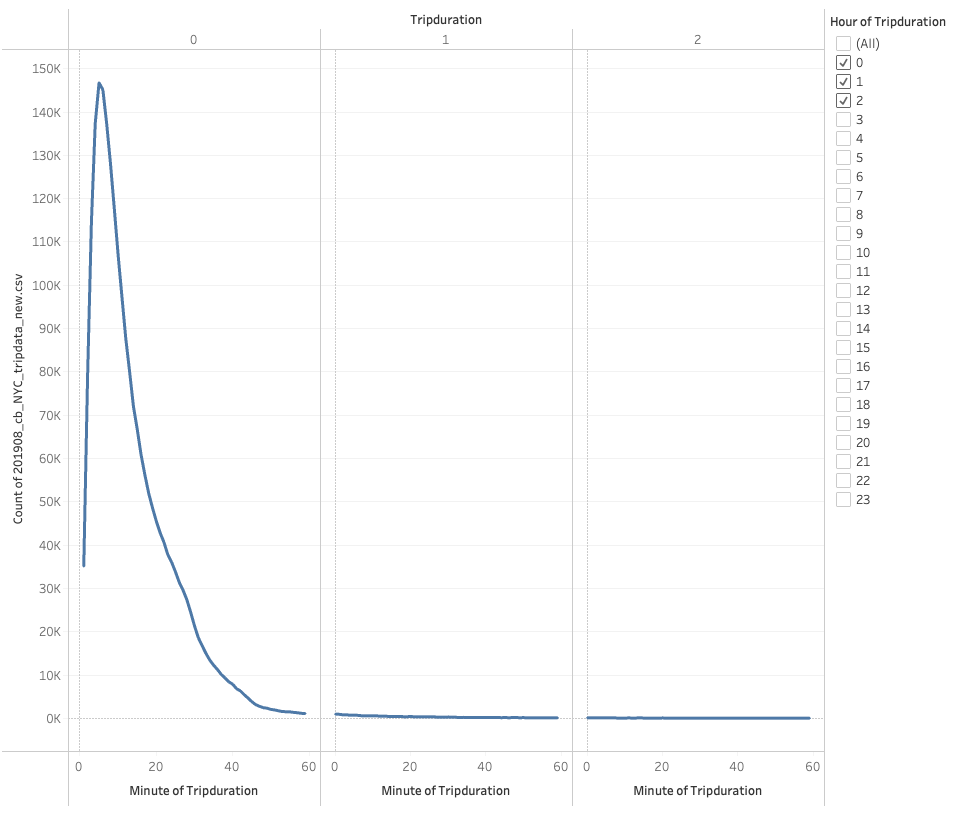
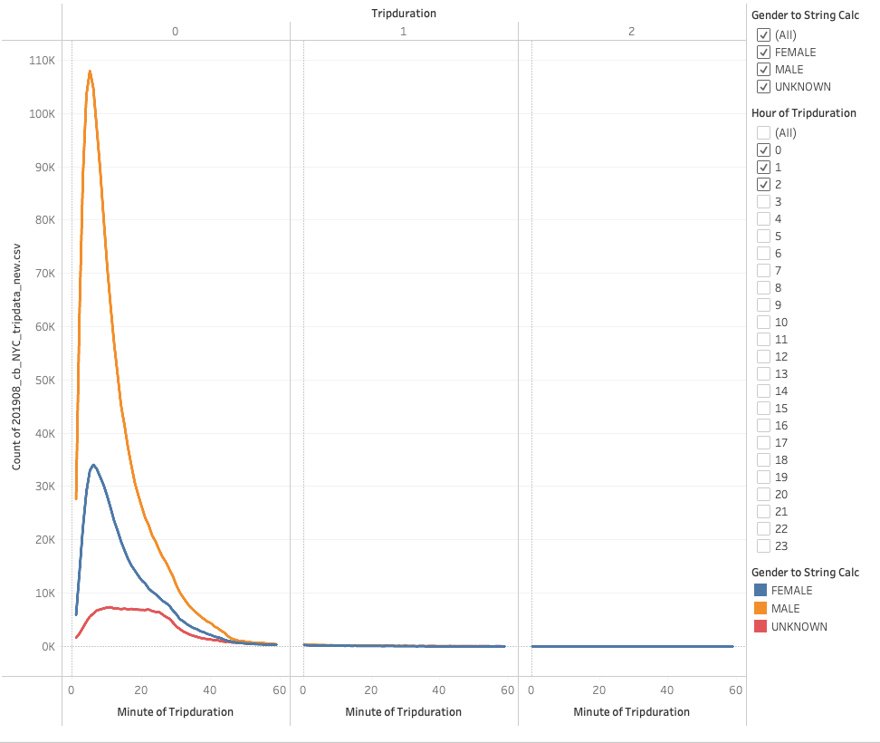
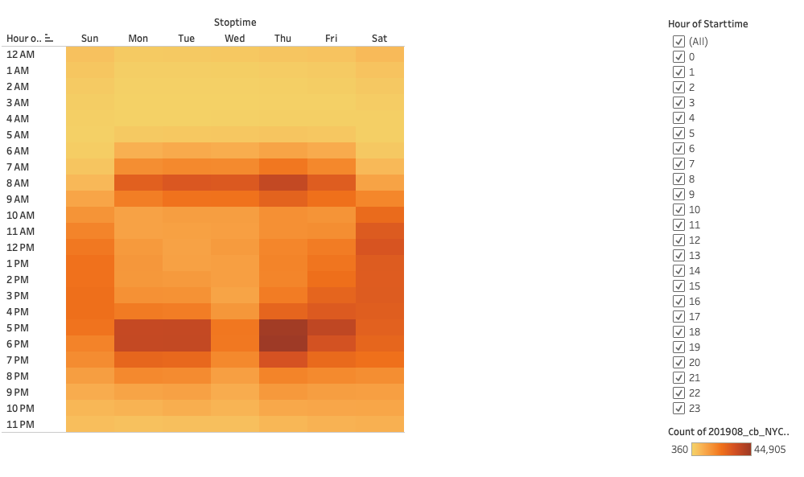
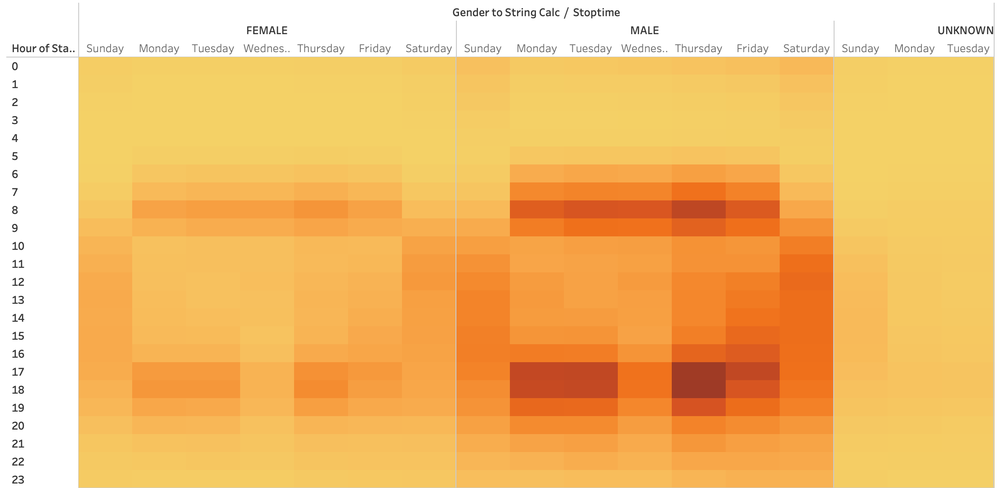
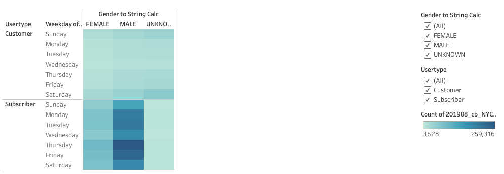
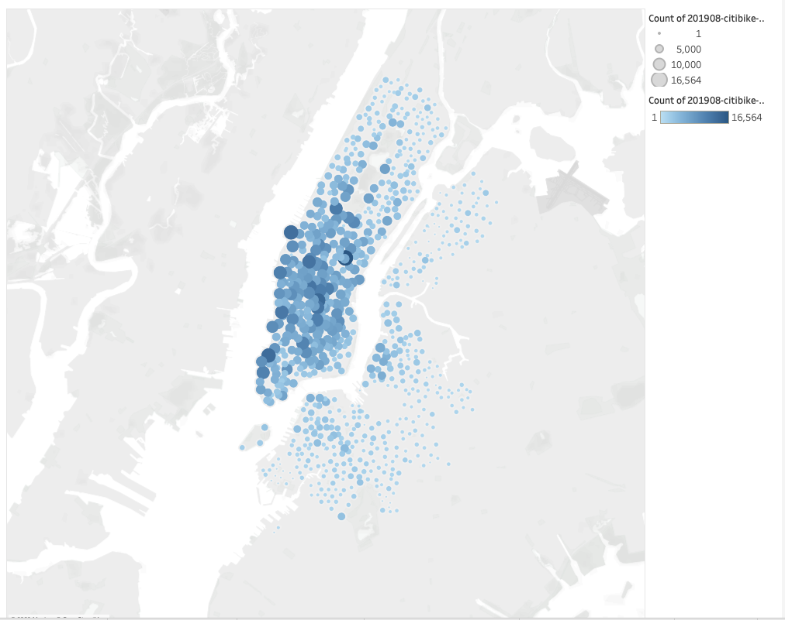
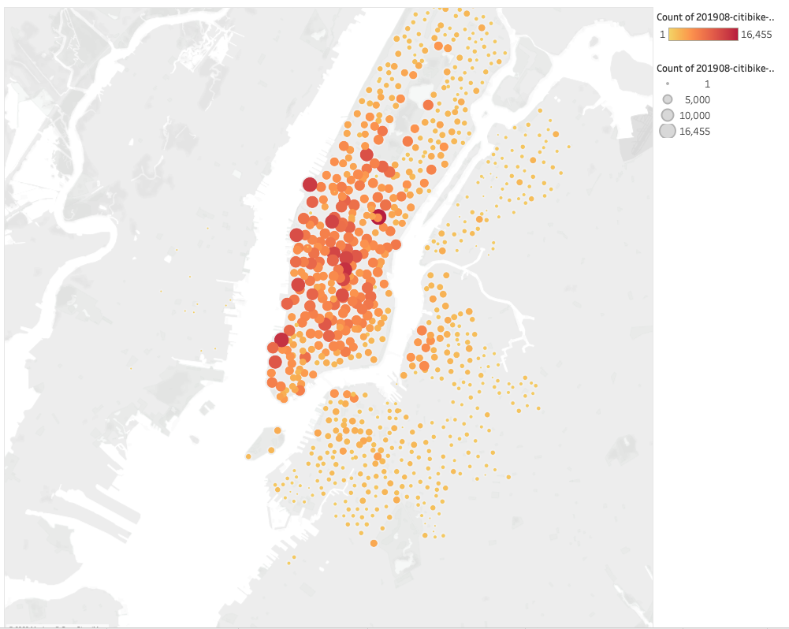

# Citi Bike Tableau

In this challenge, we are given data on the Citi bike system in New York. We can then use Tableau to visualize the data in meaningful ways.

## Results

### Checkout Times for Users

With this visualization we are able to see how long users checkout bikes for. It shows a large spike and a huge drop off before the 20-minute mark. This shows that most users do not rent the bikes for very long.

### Checkout Times by Gender

This visualization shows the previous chart’s data but split up into genders. It shows that most users are males, and the pattern of 20 minutes having a large spike continues.

### Trips by Weekday per Hour

This visualization shows the weekday and times where bikes are rented on a heatmap. The pattern that sticks out the most is between 5pm and 6pm on Mondays, Tuesdays, and Thursdays. While there is also noticeable activity Monday through Friday at 8am.

### Trips by Gender (Weekday per Hour)

This visualization shows the previous chart’s data but split up into genders. It shows that most of the users renting bikes are males.

### User Trips by Gender by Weekday

This visualization shows that mainly male subscribers are renting bikes on all days of the week. Followed up by female subscribers. Normal customers of the bike service rarely use the service.

## Further Analysis – Starting and stopping locations

These two visualization show where the starting and stopping location for each bike rental is. It is obvious that there is a hot area vs the other areas the bike service is offered. This data can be important for knowing where highly trafficked areas are with the service.
